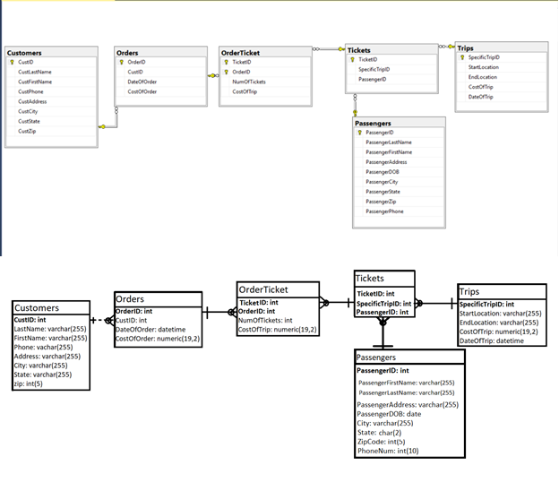

# AmtrackDatabase
This a reverse engineered version of Amtrack's customer facing database. This repo contains creation and insertion scripts with examples as well as images of UML diagrams to represent the database structure. The file that contains the creation scripts 

